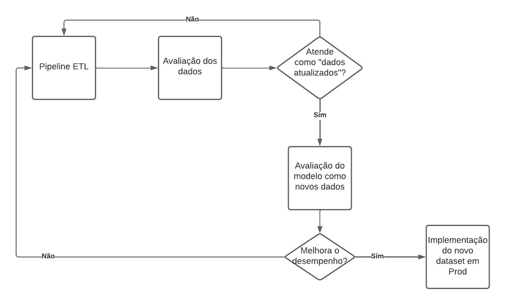

# atividade-pond-sem9
## Introdução
Ao utilizar modelos de Machine Learning em diversas aplicações um problema também é gerado. Os dados que anteriorimente alimentavam o modelo com exatidão, podem começar a não corresponder de forma correta ao que realmente está estipulado no atual cotidiano. Geralmente essa desatualização com a realidade resulta no concept drift, que retrata justamente a deteriorização da precisão do sistema resultante da desatualização dos dados.

## Solução
No meu ponto de vista, a solução ideal seria a implementação de uma pipeline ETL, responsável pela coleta, transformação e carregamento dos dados, porém em conjunto a essa, um sistema de verificação da acurácia e confiabilidade desses novos dados. Caso apresente melhora significativa no modelo com os novos dados apurado, seria implementado definitivamente no dataset do modelo em produção. Segue a arquitetura que ilustra a ideia:

 - Pipeline ETL: A partir de um gatilho ou de uma automação para rodar diariamente, seriam capturados novos dados para tentativa de implementação no modelo. Lembrando que além da extração dos dados, teria que ocorrer toda uma normalização para se adequar ao padrão do dataset.

 - Avaliação dos dados: Seria um script, ou um microsserviço dentro da aplicação, que seria ativado apenas quando houvessem novos dados. A validação seria embasada na presença ou não de "concept drift".
 
 - Avaliação do modelos com os novos dados: Testar os dados atualizados introduzindo-os no dataset do modelo, visando aumentar a acurácia.

 - Implementação do novo dataset em Prod: Caso a acurácia esteja mais alta e sem "concept drift", realizar a implementação dos dados atualizados em produção.

## Conclusão

A solução proposta visa manter o sistema constantemente atualizado, por meio de scripts rotineiros e pipelines automatizadas. Porém mesmo com a solução em prática, o ideal seria a presença de uma equipe de acompanhamento do modelo preditivo, sempre avaliando possíveis melhoras na acurácia. Apesar de toda a dificuldade e cuidados para manter o mdoelo sempre atualizado, são custos necessários para prezar pela qualidade da tecnologia, que pode ser decisiva em diversas empresas e setores que utilizam a mesma para diversas causas importantes. Como por exemplo, predições na área da saúde, construção civil, etc.

## Referências Bibliográficas

-Domingos, P. (2012). A few useful things to know about machine learning.